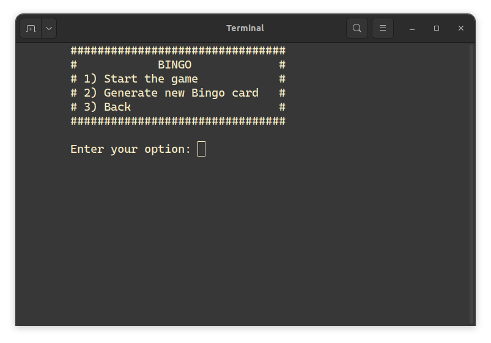
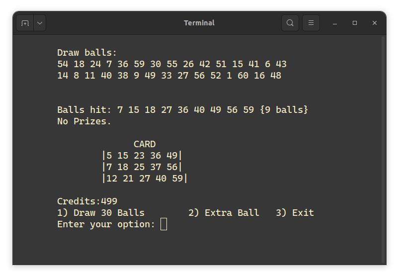
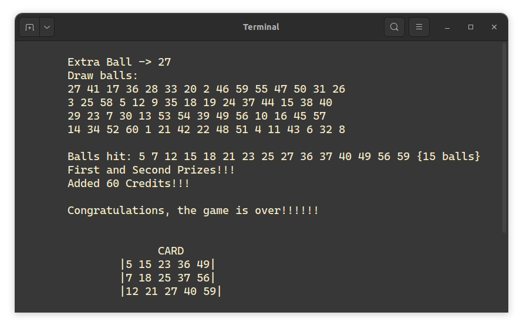

# 🎱 Console Bingo Game  

A fully functional **console-based Bingo game** built in **C++17**. This project simulates a Bingo experience with card generation, ball drawing, and prize detection, all via a command-line interface.  

## 📌 Features  
✅ Randomized **Bingo card generation** (1-60, no duplicates)  
✅ **Ball drawing system** with prize pattern detection  
✅ **Custom data protocol** for game state transmission  
✅ **Shared library integration** using `dlopen` for modular architecture  
✅ **Extra balls** feature for enhanced gameplay  

## 🛠️ Technologies Used  
- **C++17**  
- **Linux / Windows (WSL, Virtualization recommended)**  
- **Dynamic Libraries (`dlopen`, shared objects)**  

## 🎮 Pattern of prizes

## 📸 Screenshots  
(Add your gameplay screenshots here)  

  
  
  

## 🚀 How to Run  

### 1️⃣ Clone the repository  
```sh
git clone https://github.com/tyhago14/Bingo-Game.git
```  

### 2️⃣ Compile and run the project  
```sh
./build-and-run.sh
```  

### 3️⃣ Just Run the game  
```sh
./run.sh
```  

## 📜 License  
This project is licensed under the **MIT License**.  
